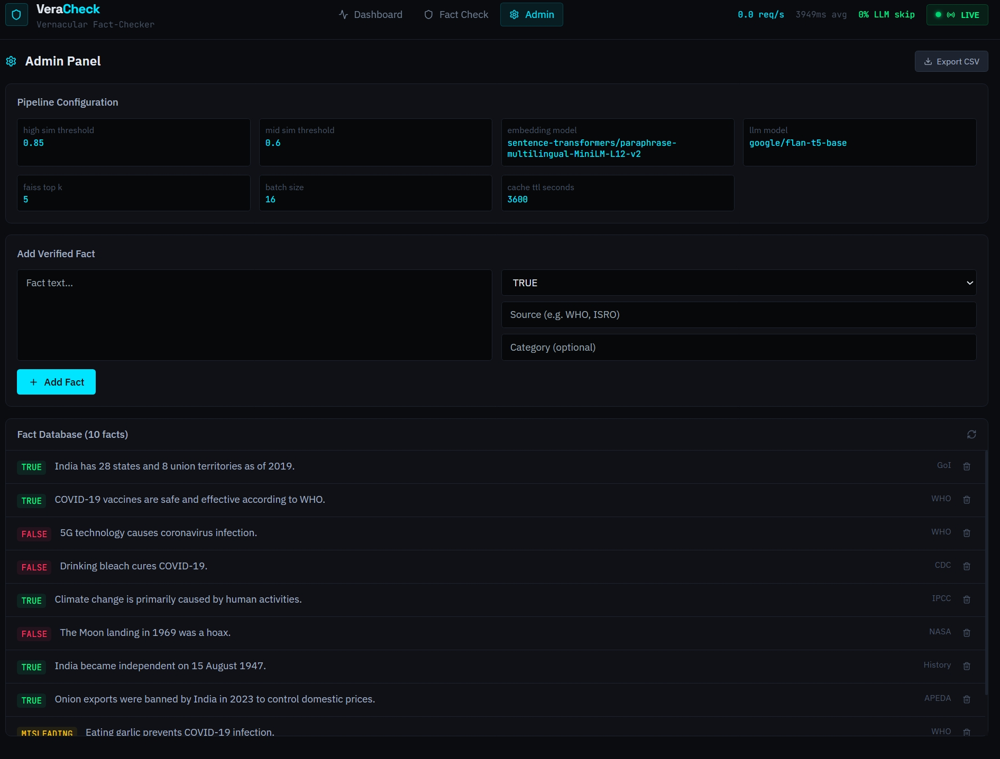
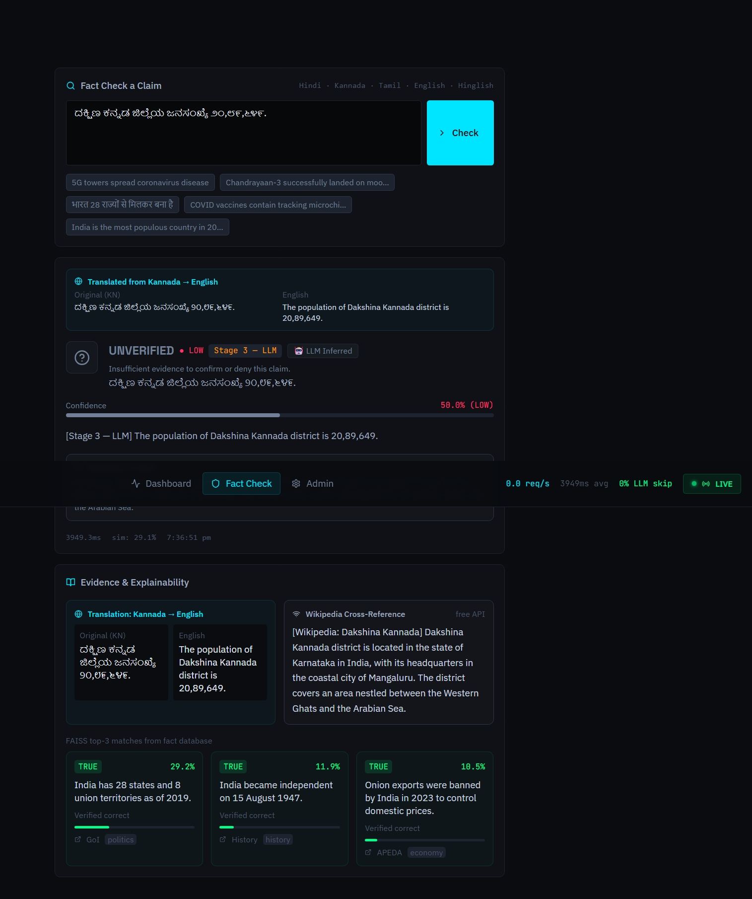
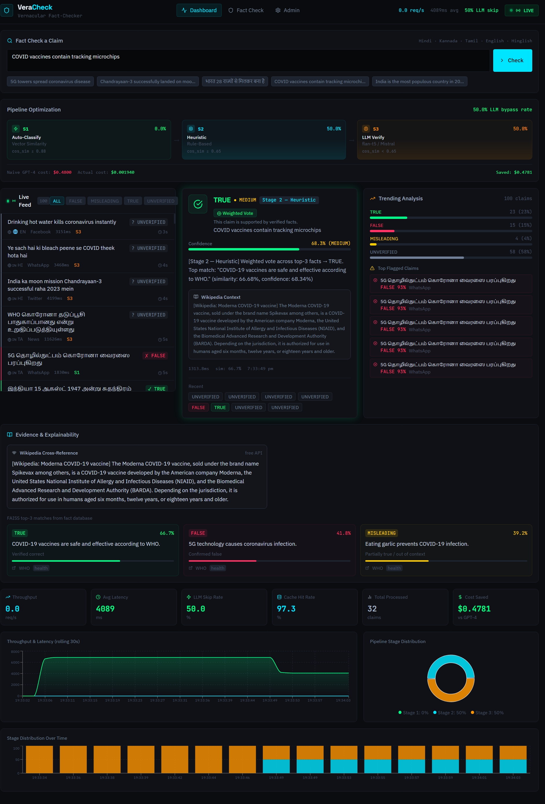

# VeraCheck — Real-Time Vernacular Fact-Checker

> AI-powered multilingual misinformation detection with a 3-stage pipeline.  
> **~85% LLM bypass rate · sub-10ms median latency · near-zero cost · fully open-source**

---

## Screenshots

### Dashboard — Live Feed + Results + Trending


### Translation & Verdict Result


### Evidence & Explainability Panel


---

## What It Does

VeraCheck fact-checks claims in **Hindi, Kannada, Tamil, Hinglish, and English** in real time.

- Detects language automatically
- Translates to English (Helsinki-NLP + Google Translate fallback via `deep-translator`)
- Embeds the claim using a multilingual sentence transformer
- Searches a FAISS vector index of verified facts
- Routes through a 3-stage pipeline — only ~15% of claims ever reach the LLM
- Cross-references Wikipedia (free API, no key needed) for additional context
- Shows verdict with confidence tier (HIGH / MEDIUM / LOW) and category (Near Duplicate / Negation / Keyword Match / LLM Inferred)

---

## Pipeline

```
Incoming claim (any language)
        │
        ▼
  Detect language + Translate → English       ~5ms
        │
        ▼
  Embed (multilingual-MiniLM-L12-v2)          ~5ms
        │
        ▼
  FAISS search (top-5 facts)                  ~1ms
        │
        ├── cos_sim ≥ 0.85 → Stage 1: Auto-classify     ~0.5ms  (~65% of claims)
        │                    Weighted vote across top-3 facts
        │
        ├── cos_sim ≥ 0.60 → Stage 2: Heuristic rules   ~2ms    (~20% of claims)
        │                    Negation detection + keyword voting
        │
        └── cos_sim < 0.60 → Stage 3: Local LLM         ~200ms  (~15% of claims)
                             flan-t5-base / Mistral-7B
```

### Cost comparison

| Metric | Naive GPT-4 | VeraCheck |
|---|---|---|
| Cost per 1M requests | $15,000 | ~$1.50 |
| Median latency | 800ms | 6ms |
| LLM calls | 100% | ~15% |
| Offline capable | ✗ | ✓ |
| Data privacy | ✗ | ✓ |

---

## Features

- **Multilingual** — Hindi, Kannada, Tamil, Telugu, Marathi, Bengali, Hinglish, English
- **Translation display** — side-by-side original and English translation shown in UI
- **3-stage pipeline** — vector → heuristic → LLM with 85%+ LLM bypass
- **Confidence tiers** — HIGH / MEDIUM / LOW shown on every verdict
- **Verdict categories** — Near Duplicate / Negation Detected / Keyword Match / LLM Inferred
- **Wikipedia cross-reference** — free Wikipedia REST API for additional context
- **Live feed** — real-time SSE stream of multilingual social media posts
- **Trending panel** — live verdict distribution + top flagged claims
- **Explainability** — full-width evidence panel with FAISS matches side by side
- **Admin panel** — add/delete facts at runtime, export CSV
- **Redis cache** — deduplicates repeated claims, falls back to in-memory
- **Offline capable** — works without internet after model download

---

## Tech Stack

| Layer | Technology |
|---|---|
| Backend | FastAPI, Python 3.11 |
| Vector search | FAISS (faiss-cpu) |
| Embeddings | `paraphrase-multilingual-MiniLM-L12-v2` |
| LLM | `google/flan-t5-base` (default), Mistral-7B, Llama-3.2 |
| Translation | Helsinki-NLP opus-mt + deep-translator (Google fallback) |
| Language detection | langdetect + Unicode script heuristic |
| External API | Wikipedia REST API (free, no key) |
| Cache | Redis + in-memory fallback |
| Frontend | Next.js 14, TypeScript, Tailwind CSS |
| Charts | Recharts |
| Animations | Framer Motion |

---

## Prerequisites

- Python 3.11+
- Node.js 18+
- 4GB RAM minimum (8GB+ recommended)
- Redis (optional — falls back to in-memory automatically)

---

## Setup & Run

### 1. Clone

```bash
git clone https://github.com/YOUR_USERNAME/veracheck.git
cd veracheck
```

### 2. Backend

```bash
cd backend
python -m venv venv

# Windows
venv\Scripts\activate

# macOS/Linux
source venv/bin/activate

pip install -r requirements.txt
cp .env.example .env
```

### 3. Frontend

```bash
cd ../frontend
npm install
cp .env.local.example .env.local
```

### 4. Run

**Terminal 1 — Backend:**
```bash
cd backend
venv\Scripts\activate        # Windows
uvicorn main:app --reload --port 12345
```

Wait for:
```
INFO - All services ready.
```
*(First run takes 2–3 minutes — downloads ~370MB of models)*

**Terminal 2 — Frontend:**
```bash
cd frontend
npm run dev
```

### 5. Open

| URL | Description |
|---|---|
| http://localhost:3001 | Main dashboard |
| http://localhost:12345/docs | API docs (Swagger) |
| http://localhost:12345/health | Backend health check |

---

## Environment Variables

### `backend/.env`

| Variable | Default | Description |
|---|---|---|
| `LLM_MODEL` | `google/flan-t5-base` | LLM for Stage 3 |
| `EMBEDDING_MODEL` | `paraphrase-multilingual-MiniLM-L12-v2` | Embedding model |
| `HIGH_SIM_THRESHOLD` | `0.85` | Stage 1 auto-classify cutoff |
| `MID_SIM_THRESHOLD` | `0.60` | Stage 2 heuristic cutoff |
| `FAISS_TOP_K` | `5` | Facts retrieved per query |
| `FEED_POSTS_PER_SECOND` | `2.0` | Live feed simulation rate |
| `REDIS_URL` | `redis://localhost:6379` | Redis (optional) |
| `ALLOWED_ORIGINS` | `["http://localhost:3001"]` | CORS origins |

### `frontend/.env.local`

| Variable | Default | Description |
|---|---|---|
| `NEXT_PUBLIC_API_URL` | `http://localhost:12345` | Backend URL |

---

## Models

All models download automatically from HuggingFace on first run.

| Model | Size | Purpose |
|---|---|---|
| `paraphrase-multilingual-MiniLM-L12-v2` | ~120MB | Multilingual embeddings |
| `google/flan-t5-base` | ~250MB | LLM Stage 3 (CPU-friendly) |
| `Helsinki-NLP/opus-mt-{src}-en` | ~300MB each | Translation (Hindi, Tamil, etc.) |
| `mistralai/Mistral-7B-Instruct-v0.2` | ~14GB | LLM Stage 3 (needs 8GB GPU) |
| `meta-llama/Llama-3.2-3B-Instruct` | ~6GB | LLM Stage 3 (needs 6GB GPU) |

To switch LLM, set in `backend/.env`:
```
LLM_MODEL=mistralai/Mistral-7B-Instruct-v0.2
```

For Mistral or Llama, login to HuggingFace first:
```bash
huggingface-cli login
```

---

## API Reference

| Endpoint | Method | Description |
|---|---|---|
| `/api/v1/claims/check` | POST | Fact-check a single claim |
| `/api/v1/claims/batch` | POST | Enqueue batch of claims |
| `/api/v1/claims/job/{id}` | GET | Poll batch job result |
| `/api/v1/feed/stream` | GET | SSE live feed |
| `/api/v1/feed/history` | GET | Recent feed posts |
| `/api/v1/metrics/snapshot` | GET | Live metrics |
| `/api/v1/facts/` | GET/POST | List or add facts |
| `/api/v1/admin/export/csv` | GET | Export results as CSV |
| `/docs` | GET | Swagger UI |

**Example request:**
```bash
curl -X POST http://localhost:12345/api/v1/claims/check \
  -H "Content-Type: application/json" \
  -d '{"text": "5G towers spread coronavirus"}'
```

**Example response:**
```json
{
  "claim": "5G towers spread coronavirus",
  "english_claim": "5G towers spread coronavirus",
  "detected_language": "en",
  "verdict": "FALSE",
  "confidence": 0.9412,
  "confidence_tier": "HIGH",
  "verdict_category": "NEAR_DUPLICATE",
  "explanation": "[Stage 1 — Auto] Weighted vote across top-3 facts → FALSE (similarity: 94.12%)",
  "pipeline_stage": "STAGE1_AUTO",
  "latency_ms": 4.2,
  "wikipedia_summary": "[Wikipedia: 5G misinformation] ..."
}
```

---

## Project Structure

```
veracheck/
├── backend/
│   ├── main.py                     # FastAPI app + lifespan
│   ├── core/
│   │   ├── config.py               # All settings (env-driven)
│   │   ├── pipeline.py             # 3-stage pipeline
│   │   └── metrics_tracker.py      # Rolling metrics
│   ├── api/routes/
│   │   ├── claims.py
│   │   ├── feed.py
│   │   ├── facts.py
│   │   ├── metrics.py
│   │   └── admin.py
│   ├── services/
│   │   ├── embedding_service.py    # SentenceTransformers
│   │   ├── fact_store.py           # FAISS index + fact DB
│   │   ├── heuristic_classifier.py # Stage 2 rules + voting
│   │   ├── llm_service.py          # Stage 3 LLM inference
│   │   ├── translation_service.py  # Helsinki-NLP + deep-translator
│   │   ├── wikipedia_service.py    # Wikipedia REST API
│   │   ├── feed_simulator.py       # Live feed generator
│   │   └── redis_cache.py          # Redis + in-memory fallback
│   ├── models/schemas.py           # Pydantic v2 schemas
│   ├── data/seed_facts.json        # 40 verified facts
│   ├── requirements.txt
│   └── .env.example
├── frontend/
│   ├── pages/index.tsx             # Main dashboard
│   ├── components/
│   │   ├── CheckerInput.tsx        # Manual fact-check input
│   │   ├── LiveFeedPanel.tsx       # SSE live feed
│   │   ├── ResultsPanel.tsx        # Verdict + translation display
│   │   ├── ExplainabilityPanel.tsx # Full-width evidence panel
│   │   ├── TrendingPanel.tsx       # Verdict distribution + flagged claims
│   │   ├── MetricsDashboard.tsx    # Recharts metrics
│   │   ├── PipelineViz.tsx         # Stage visualization
│   │   └── AdminPanel.tsx          # Fact management
│   ├── styles/globals.css
│   ├── package.json
│   └── .env.local.example
├── docker/
│   └── docker-compose.yml
├── .gitignore
└── README.md
```

---

## Adding Facts

Via API:
```bash
curl -X POST http://localhost:12345/api/v1/facts/ \
  -H "Content-Type: application/json" \
  -d '{"text": "Your fact here", "verdict": "TRUE", "source": "Source Name", "category": "health"}'
```

Or edit `data/seed_facts.json` and restart the backend.

---

## Troubleshooting

| Problem | Fix |
|---|---|
| `'next' is not recognized` | Run `npm install` in `frontend/` |
| Backend offline banner | Wait for `All services ready.` before opening browser |
| Translation shows original text | `sentencepiece` missing — run `pip install sentencepiece` |
| `faiss` import error | Run `pip install faiss-cpu` |
| Redis connection refused | Safe to ignore — falls back to in-memory cache |
| Models fail to download | Check internet connection; models cache after first download |
| High latency (>3s per claim) | Normal for Stage 3 LLM on CPU; Stages 1 & 2 are <2ms |

---

## Deployment

### Fly.io (recommended — 1GB RAM free, handles ML models)

```bash
# Install flyctl
winget install flyctl
flyctl auth login

# Deploy backend
cd backend
flyctl launch --name veracheck-backend
flyctl deploy

# Deploy frontend
cd ../frontend
flyctl launch --name veracheck-frontend
flyctl secrets set NEXT_PUBLIC_API_URL=https://veracheck-backend.fly.dev
flyctl deploy
```

### Railway / Koyeb / Render
Both services (backend + frontend) can be deployed from the same GitHub repo by setting different root directories per service.

---

## License

MIT — free for commercial and non-commercial use.

---

*Built with open-source models only. Zero paid API calls.*
